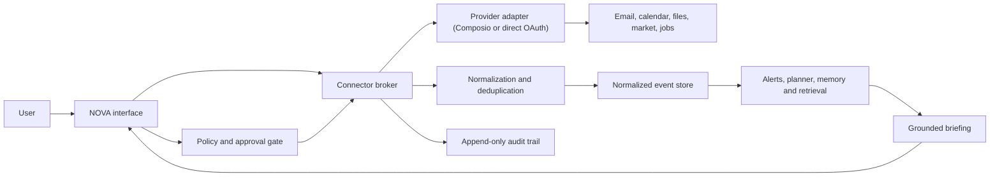

# NOVA Core Architecture

NOVA is an evidence-first work intelligence system. It can observe authorized sources, normalize their data, derive useful signals, and propose actions. It must never imply that an account is connected or that an action happened unless a recorded connector result proves it.

## Design rules

1. **Observe before acting.** New connectors begin read-only.
2. **Evidence before inference.** Every summary, deadline, and alert retains source references.
3. **Deterministic controls around probabilistic models.** Models may classify, summarize, and retrieve; code controls permissions, deduplication, time calculations, conflicts, and approval requirements.
4. **Provider independence.** Composio can supply connections and tools, but NOVA's domain model does not depend on Composio-specific payloads.
5. **Least privilege.** Every capability is granted separately and can be revoked.

## System map

## Layers

### Connector broker

The broker owns account identity, capability discovery, sync cursors, provider health, and revocation. A provider adapter translates remote records into NOVA events and implements capability calls. The rest of NOVA only sees the connector contract.

### Ingestion pipeline

Ingestion validates payloads, assigns stable external IDs, normalizes timestamps, classifies sensitivity, strips unsupported fields, and upserts idempotently. A sync run records its cursor, counts, failure state, and timestamps. Webhooks and polling enter the same pipeline.

### Normalized event store

Email, meetings, deadlines, job opportunities, market signals, news, and tasks share a compact event envelope: source, kind, occurred time, optional due time, title, summary, source reference, sensitivity, and structured metadata. Raw provider payloads are not the long-term application contract.

### Intelligence engines

- Alerts calculate urgency and deduplicate deterministic signals.
- Planner detects overlaps and derives scheduled or deadline items.
- Memory builds bounded, source-linked chunks and ranks them by lexical relevance plus recency.
- Job matching scores explicit skill overlap and explains the result.
- Briefing composes only from stored evidence and labels empty states honestly.

### Action gate

Reading and local analysis can run automatically after consent. External side effects such as sending mail, creating meetings, or writing notifications require an explicit approval immediately before execution. The executed request, approval, result, and error are written to the audit trail.

## Persistence

Cloudflare D1 stores profiles, connector accounts, consent grants, normalized source items, alerts, planner items, memory records, sync runs, and audit entries. Secrets and provider access tokens must remain in a secrets manager or provider vault; only opaque references belong in D1.

The private `/workspace` surface is the cross-device system of record. Quick-captured text and normalized connector records retain their source content, a compact summary, tags, source identity, and content hash. Summaries default to deterministic extraction with zero model calls. A later enhanced-summary worker may call a model only for changed hashes, in bounded batches, under the user's daily limit.

Gmail, Outlook, and LinkedIn use the connector contract rather than appearing directly in product storage code. Composio is the first OAuth and tool adapter; it can be replaced with customer-owned Google, Microsoft, or LinkedIn OAuth without changing the D1 schema or the workspace UI.

## Background work

Production monitoring should use scheduled workers and verified webhooks. Each job acquires an idempotency key, respects per-connector backoff, records a sync run, and only emits a notification when a deterministic alert transitions into a notifiable state. The web UI is a client of this system, not the scheduler.

## Failure behavior

- Expired authorization changes the account to `reauth_required` and stops sync.
- Partial sync preserves the previous cursor and records the failure.
- Duplicate webhooks are ignored by provider event ID and idempotency key.
- Model failure falls back to unsummarized source facts; it never blocks revocation or policy checks.
- Missing data produces an explicit empty state rather than invented plans, messages, or balances.

## Delivery sequence

1. Prove one read-only email connection through Composio.
2. Validate webhook signatures, sync cursors, revocation, and deduplication.
3. Add calendar read, deadline extraction, and planner conflicts.
4. Add source-linked retrieval and user-controlled memory retention.
5. Add draft-only suggestions, then approval-gated write actions.
6. Add background monitoring, notifications, market feeds, and voice after the audit path is proven.
